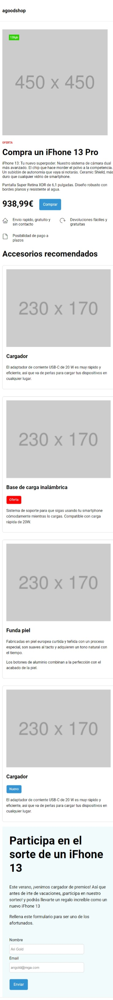
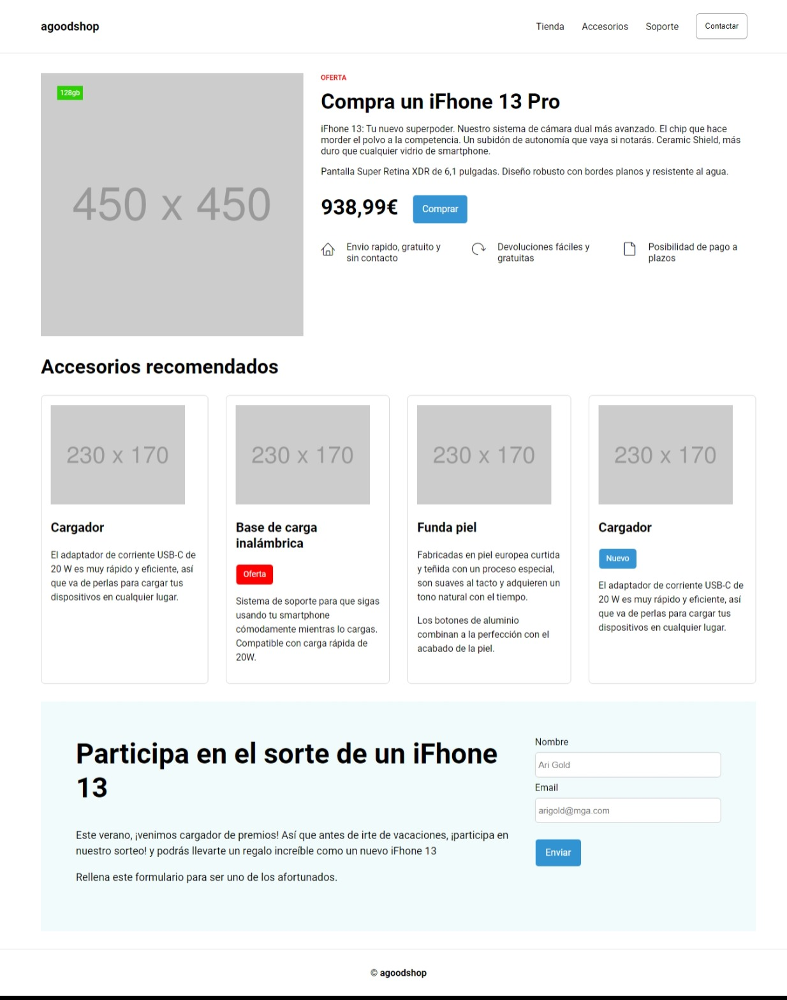

# UNIR - Actividad 3

Maquetación Web usando HTML, CSS generado con SASS

Autora: Mairi Tikk

## Estructura de carpetas

- css
    - main.css : css principal generado con SASS
- scss
    - main.scss : importa los scss _base, _components y _layout
    - _base.scss : estilo del body y define colores por defecto
    - _components.scss : define el estilo de los componentes
    - _layout.scss : define la ubicación de los componentes
- index.html : contenido de la página principal
- package.json : archivo de configuracion 

Las imagenes sean obtenido de la página https://placehold.jp/

## Pruebas de maquetación

En la carpeta de **img** se encuentran test de maquetación.

### Mobile

### Screen 

